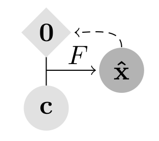
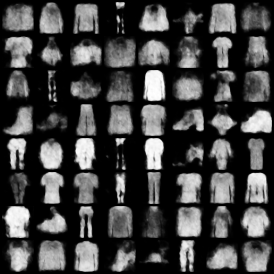
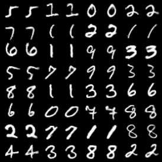
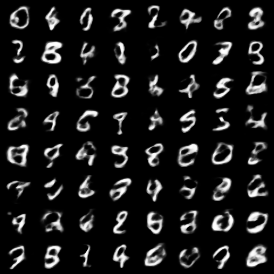

Gradient Origin Networks in PyTorch
===================================

Unofficial PyTorch implementation of [Gradient Origin Networks](https://arxiv.org/abs/2007.02798).



| Reconstructions | Samples |
| ----------------| ------- |
|  |  |
|  |  |


Usage
-----

### Training

Requirements:
- [pytorch](https://github.com/pytorch/pytorch)
- [numpy](https://github.com/numpy/numpy)
- [hydra](https://github.com/facebookresearch/hydra)

After cloning the repository, a GON can be trained using the `train_gon.py` script:

```bash
python train_gon.py dataset.name=<MNIST|FashionMNIST|CIFAR10> dataset.root=<data-root>
```

All configuration options are listed in `config/config.yaml`. See the [hydra](https://github.com/facebookresearch/hydra) documentation for more information on configuration.


### From Code

Install the package:

```bash
pip install gon-pytorch
```

Instantiate a GON with [NeRF](https://arxiv.org/abs/2003.08934) positional encodings:

```python
import torch
from gon_pytorch import NeRFPositionalEncoding, ImplicitDecoder, GON, SirenBlockFactory

pos_encoder = NeRFPositionalEncoding(in_dim=2)
decoder = ImplicitDecoder(
    latent_dim=128,
    out_dim=3,
    hidden_dim=128,
    num_layers=4,
    block_factory=SirenBlockFactory(),
    pos_encoder=pos_encoder
)
gon = GON(decoder)

coords = torch.randn(1, 32, 32, 2)
image = torch.rand(1, 32, 32, 3)

# Obtain latent
latent, latent_loss = gon.infer_latents(coords, image)

# Reconstruct from latent
recon = gon(coords, latent)

# Optimize model
loss = ((recon - image) ** 2).mean()
loss.backward()
```


Differences to the original implementation
------------------------------------------

- Cross-entropy is used as loss instead of MSE as this seems to be improve results
- The original implementation obtains gradients with respect to the origin by calculating the mean over the latent loss. This seems to cause a bias on the batch-size as the mean loss is evenly distributed on the single latents in the backward pass. This is fixed by summing over the batch dimension for the latent loss instead of using the mean.
- Latent modulation from [Modulated Periodic Activations for Generalizable Local Functional Representations](https://arxiv.org/abs/2104.03960) is implemented and can optionally be used.


Citations
---------

```bibtex
@misc{bondtaylor2021gradient,
      title={Gradient Origin Networks}, 
      author={Sam Bond-Taylor and Chris G. Willcocks},
      year={2021},
      eprint={2007.02798},
      archivePrefix={arXiv},
      primaryClass={cs.CV}
}
```

```bibtex
@misc{sitzmann2020implicit,
      title={Implicit Neural Representations with Periodic Activation Functions}, 
      author={Vincent Sitzmann and Julien N. P. Martel and Alexander W. Bergman and David B. Lindell and Gordon Wetzstein},
      year={2020},
      eprint={2006.09661},
      archivePrefix={arXiv},
      primaryClass={cs.CV}
}
```

```bibtex
@misc{mildenhall2020nerf,
      title={NeRF: Representing Scenes as Neural Radiance Fields for View Synthesis}, 
      author={Ben Mildenhall and Pratul P. Srinivasan and Matthew Tancik and Jonathan T. Barron and Ravi Ramamoorthi and Ren Ng},
      year={2020},
      eprint={2003.08934},
      archivePrefix={arXiv},
      primaryClass={cs.CV}
}
```

```bibtex
@misc{mehta2021modulated,
    title   = {Modulated Periodic Activations for Generalizable Local Functional Representations}, 
    author  = {Ishit Mehta and Michaël Gharbi and Connelly Barnes and Eli Shechtman and Ravi Ramamoorthi and Manmohan Chandraker},
    year    = {2021},
    eprint  = {2104.03960},
    archivePrefix = {arXiv},
    primaryClass = {cs.CV}
}
```